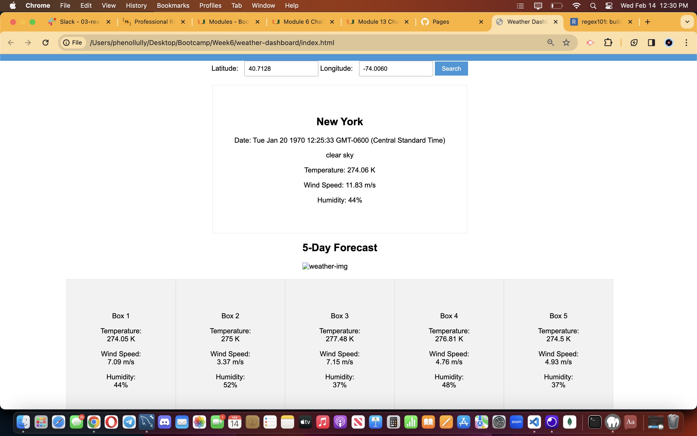

# 06 Server-Side APIs: Weather Dashboard

## Description

Provide a short description explaining the what, why, and how of your project. Use the following questions as a guide:

- What was your motivation?
  My motivation was to prove to myself that I can create at least a functional weather dashboard using a third party API
- Why did you build this project? (Note: the answer is not "Because it was a homework assignment.")
I built this project to improve on my skills as a developer and understanding how to build a third party API
- What problem does it solve?
The problem it solves is implementing a third party API and making it functional
- What did you learn?
I learned that fecthing a third party API isn't as hard as it seems as long as you can read and interpret documentation and utilize the 
resources around you, you should be fine

## Installation

What are the steps required to install your project? Provide a step-by-step description of how to get the development environment running.

First a github repository needs to be created make sure it has a README.md file, then clone the repository and paste it in your Week 6 folder. Then open the developer folder in the class repository and copy the material inside the folder into the repository folder. Then you can continue work on the assignment.

## Usage

Provide instructions and examples for use. Include screenshots as needed.

To add a screenshot, create an `assets/images` folder in your repository and upload your screenshot to it. Then, using the relative filepath, add it to your README using the following syntax:

    
  
    

## Credits
CHARLES PUENTE-MATOS ONE OF THE TUTORING TEACHERS ASSISTED ME ON PART OF THIS ASSIGNMENT!
I DID USE YOUTUBE AND OTHER SITES TO HELP ME IMPLEMENT AND COME TO AN UNDERSTANDING OF CODE THAT I AM USING!!!

## User Story

```
AS A traveler
I WANT to see the weather outlook for multiple cities
SO THAT I can plan a trip accordingly
```

## Acceptance Criteria

```
GIVEN a weather dashboard with form inputs
WHEN I search for a city
THEN I am presented with current and future conditions for that city and that city is added to the search history
WHEN I view current weather conditions for that city
THEN I am presented with the city name, the date, an icon representation of weather conditions, the temperature, the humidity, and the wind speed
WHEN I view future weather conditions for that city
THEN I am presented with a 5-day forecast that displays the date, an icon representation of weather conditions, the temperature, the wind speed, and the humidity
WHEN I click on a city in the search history
THEN I am again presented with current and future conditions for that city
```

## Mock-Up

The following image shows the web application's appearance and functionality:


## Grading Requirements

> **Note**: If a Challenge assignment submission is marked as “0”, it is considered incomplete and will not count towards your graduation requirements. Examples of incomplete submissions include the following:
>
> * A repository that has no code
>
> * A repository that includes a unique name but nothing else
>
> * A repository that includes only a README file but nothing else
>
> * A repository that only includes starter code

This Challenge is graded based on the following criteria: 

### Technical Acceptance Criteria: 40%

* Satisfies all of the above acceptance criteria plus the following:

    * Uses the OpenWeather API to retrieve weather data.

    * Uses `localStorage` to store persistent data.

### Deployment: 32%

* Application deployed at live URL.

* Application loads with no errors.

* Application GitHub URL submitted.

* GitHub repository that contains application code.

### Application Quality: 15%

* Application user experience is intuitive and easy to navigate.

* Application user interface style is clean and polished.

* Application resembles the mock-up functionality provided in the Challenge instructions.

### Repository Quality: 13%

* Repository has a unique name.

* Repository follows best practices for file structure and naming conventions.

* Repository follows best practices for class/id naming conventions, indentation, quality comments, etc.

* Repository contains multiple descriptive commit messages.

* Repository contains quality readme file with description, screenshot, and link to deployed application.

## Review

You are required to submit BOTH of the following for review:

* The URL of the functional, deployed application.

* The URL of the GitHub repository. Give the repository a unique name and include a readme describing the project.

- - -
© 2023 edX Boot Camps LLC. Confidential and Proprietary. All Rights Reserved.
var queryURL = "https://api.openweathermap.org/data/2.5/weather?lat=" + latitude + "&lon=" + longitude + "&appid=" + "c1bc0050e8b1441f96eb602f81355ba2";

